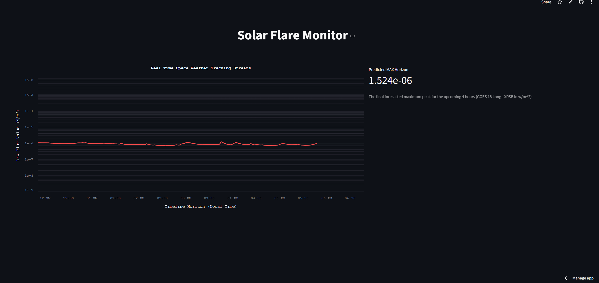

# Solar Flare Predictor and Tracker
### [Click Here to View the Website](https://solar-flare-predictor.streamlit.app)

This is a real-time data engineering pipeline gathering and using GOES 18 Long XRSB data from the NOAA. The machine learning model uses this data to create a prediction for the next max value within the next 4 hours. The data and prediction is tracked and displayed in a clean Streamlit user interface.


### Data Pipeline and Feature Engineering
* **Data Ingestion:** Fetches real-time JSON payloads from the NOAA Space Weather Prediction Center API, filters out alternating waveband rows to isolate the 0.1-0.8nm longwave signal
* **Rolling Features:** Computes a trailing 240-minute history across the filtered dataset to engineer features on the fly, including rolling mean, minimum, maximum, standard deviation, variance, maximum flux velocity, and average slope.
* **Log Transformations:** Converts raw flux metrics into logarithmic scales to assist the tree-based model in establishing distinct split boundaries across multi-order magnitude changes.

### Machine Learning Framework
* **Residual Tracking Strategy:** Time-series forecasting often suffers from high continuous temporal correlation, where the model simply expects the next 4 hour maximum value to be the same as the previous 4 hour maximum value. To prevent and take advantage of this, the XGBoost model is trained to predict the residual errors of a competitive rolling-maximum baseline.
* **Model Evaluation Metrics:** The residual architecture achieved a 1.17% relative Mean Absolute Error (MAE) optimization over the standard persistence baseline, moving from 0.1363 (baseline) down to 0.1347 (model).
* **Production Serialization:** To run inference efficiently on the web dashboard without hosting a large database file, the model was trained locally using a 760MB SQLite database (model_data.db) and its optimized weights were exported directly to a lightweight solar_model.json file.

### Repository File History
* **app.py:** The production Streamlit application script containing the live streaming/tracking logic and model inference loops.
* **solar_model.json:** The exported, pre-trained XGBoost regressor model file.
* **trainingdata.py / testingdata.py:** Scripts used to construct, filter, and write the initial historical SQL database.
* **testing_notebook.py to testing_notebook3.py:** The files in this repository track the iterative design phases of the project: Raw exploratory notebooks tracking attempts at building and evaluating different models

### Attempts at Building and Evaluating different XGBOOST models
* **trainingdata.py (Attempt 1 - Raw Regression on all data):** Model struggled to track with the peaks and troughs of the xrsb values, often underpredicted higher class flares and overpredicted minor class flares
* **testingdata2.py: (Attempt 2 - Data Splitting Failure):** Attempted to incorporate multiple models in order to eliminate attempt 1's failure during peaks/troughs. The different models were to be chosen dependent on the xrsb_mean value. Hence, the model attempting to guess higher class flares would be trained and specialized on data where xrsb_mean > 6.0 ( b class flare). This was an attempt to create specialized models that excelled at their one specific data type. However, the model performed even worse because their specialized aspect did not allow them to predict transitions between the two low and high states of solar flare classes.
* **testing_notebook.py to testing_notebook3.py:** Returned to original regression on all data -> tested against a baseline of the previous 4 hours maximum value. The baseline was highly successful with a LOG Mean of .1363, yet failed to capture the extremeness of the peaks and troughs. In order to create a model better than the baseline, I switched to a residual based model which now only had to calculate the difference between the baseline and the actual incoming value. This residual model was successful...

### Local Installation and Running
Install the required dependencies inside your virtual environment:
```bash
pip install streamlit pandas numpy xgboost altair urllib3 scikit-learn
```
To start the auto-refreshing dashboard interface on your local server, run:

```bash
streamlit run app.py
```
